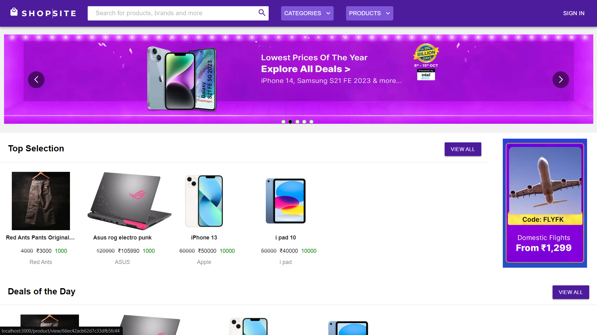
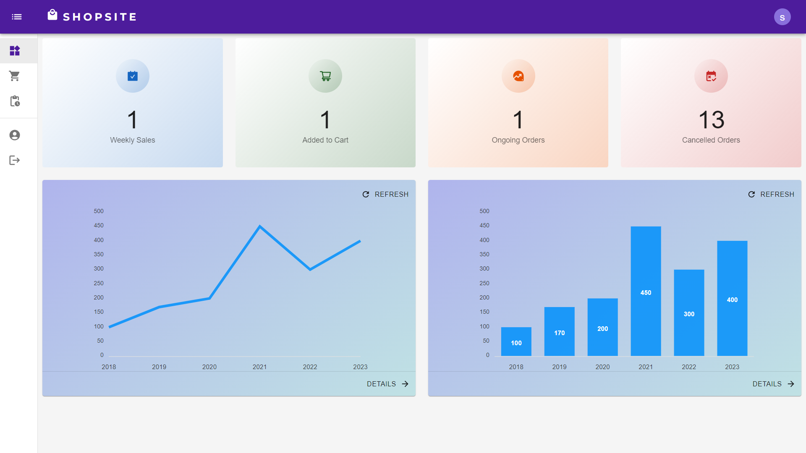
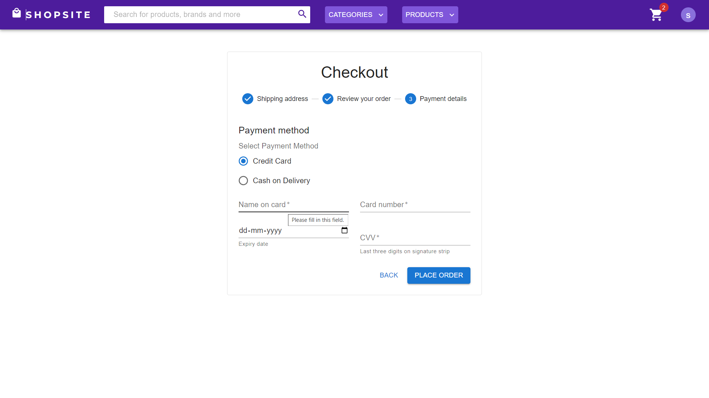

<h1 align="center"> 🛒 SHOPSITE: E-commerce Platform </h1>

## About

ShopSite is a modern e-commerce platform built using the MERN (MongoDB, Express.js, React, Node.js) stack. It provides a seamless shopping experience for customers while equipping sellers with the necessary tools to manage their products and sales efficiently.

## Deployment
- **Frontend:** Hosted on Vercel [https://shopsite-frontend.vercel.app/](https://shopsite-frontend.vercel.app/)
- **Backend:** Hosted on Render [https://shopsite-server.onrender.com/](https://shopsite-server.onrender.com/)



## Features

- **User Registration & Authentication:** 
  - Customers and sellers can register and log in securely using JWT tokens.
  
- **Product Search & Filtering:** 
  - Customers can search for products by name or browse through categories like Electronics, Clothing, Kitchen, and more.

- **Cart System:** 
  - Customers can add products to their cart, modify quantities, and proceed to checkout with a streamlined process.

- **Reviews and Ratings:** 
  - Customers can leave reviews and rate products, helping others make informed decisions and building trust within the community.

- **Seller Dashboard:** 
  - Sellers have access to a dashboard where they can add, update, and delete products. They can view sales data and customer interactions for better store management.



- **Order Management:** 
  - Sellers can track and update the status of orders, ensuring smooth and timely delivery.

- **Secure Payment Integration:** 
  - Integrated with Razorpay for secure payment processing.



## Technologies Used

- **Frontend:** 
  - React.js, Redux Toolkit for state management, Material UI for design, and Styled Components for styling.
  
- **Backend:** 
  - Node.js and Express.js for the server-side logic, with JWT tokens for authentication.
  
- **Database:** 
  - MongoDB with Mongoose for data management.
  
- **Data Visualization:** 
  - React ApexCharts for visual representation of sales data in the seller dashboard.

## Installation

### Prerequisites
- Node.js and npm installed
- MongoDB installed and running locally

### Steps
<br>

# Installation

```sh
git clone https://github.com/Yogndrr/MERN-Ecommerce-Site.git
```
Open 2 terminals in separate windows/tabs.

Terminal 1: Setting Up Backend 
```sh
cd backend
npm install
npm start
```

Create a file called .env in the backend folder.
Inside it write this :

```sh
MONGO_URL = mongodb://127.0.0.1/ecommerce

SECRET_KEY = 'secret-key'
```
Instead of this link write your database link.

Terminal 2: Setting Up Frontend
```sh
cd frontend
npm install
npm start
```
Now, navigate to `localhost:3000` in your browser. 
The Backend API will be running at `localhost:5000`.
<br>
# Error Solution

If you encounter a network error while signing up, follow these steps to resolve it:

1. Navigate to the `src > redux > userHandle.js` file.

2. Add the following line after the import statements:

```javascript
const REACT_APP_BASE_URL = "http://localhost:5000";
```

3. Replace all instances of `process.env.REACT_APP_BASE_URL` with `REACT_APP_BASE_URL`.

The issue arises because the `.env` file in the frontend may not work for all users, while it works for me.

These steps should resolve the network error in the frontend. If the issue persists, feel free to contact me for further assistance.

Don't forget to leave a star for this project if you found the solution helpful. Thank you!


